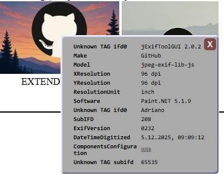

# JPEG EXIF Lib Javascript

A Javascript library, to parse and edit the EXIF attribute on the fly from your webpage.

### How to install:
Add this line to your webpage:
```html
<script src="https://adrianotiger.github.io/jpeg-exif-lib-js/lib/jpg.js"></script>
```

### How to use:

```javascript
/** Create a new JPG file **/
/* image can be an arrabuffer, a base64 string, a File or a link */
let jpg = new JPG(image);

/** Wait until the file was parsed completely  **/
jpg.open().then(()=>{
    // Edit or add an EXIF attribute
  jpg.setExif(JPGCONST.EXIF.SOFTWARE, "GitHub Editor");
    // Get the binary buffer of the image
  let newBinaryFile = jpg.getBuffer();
});
```

### Demo: 


You can try some demos directly from this GitHub page:  
<a href="https://adrianotiger.github.io/jpeg-exif-lib-js/">https://adrianotiger.github.io/jpeg-exif-lib-js/</a>  

- Binary viewer - it is a hex analyzer, perfect if you are trying to create jpegs by yourself
- canvas extender - add EXIF attributes to your canvas, before you download them locally

### Note:
It is a work in progress. The library has some base functionality but need to be structured and need to be completed. Feel free to help me :D

### Milestones:
- Add more Exif TAGS to the library
- Structurate library
- Better documentation
- Add tools


### EXIFs you can edit/add at the moment:
See file [lib/jpg/jpgconst.js](https://github.com/Adrianotiger/jpeg-exif-lib-js/blob/bd48c0700597e93cc91d5f2fd1a3c4fcab494f0b/lib/jpg/jpgconst.js)

|Exif|Constant|Type|Description|    
|-----|-----|----|----|
|Software|JPGCONST.EXIF.SOFTWARE|ASCII|Software used to generate the image|
|DateTime|JPGCONST.EXIF.DATETIME|DATE|Date, when the JPG was generated|
|Copyright|JPGCONST.EXIF.COPYRIGHT|ASCII|Author of the image|

# JPEG EXIF Tool
  
This project also contains a `tools.js` file in the library folder.
If you add it together with the `jpg.js` library, you'll get some helper functions for your webpage:  
### `JpegTools.addContextToImages()`
Adds a context menu to every image on the webpage. Once opened, it displays a list of available EXIF attributes.  

### `JpegTools.generateExifList(jpeg, options)`
It returns a list of EXIF attributes as array:  
``[{key, value, description}, ...]``